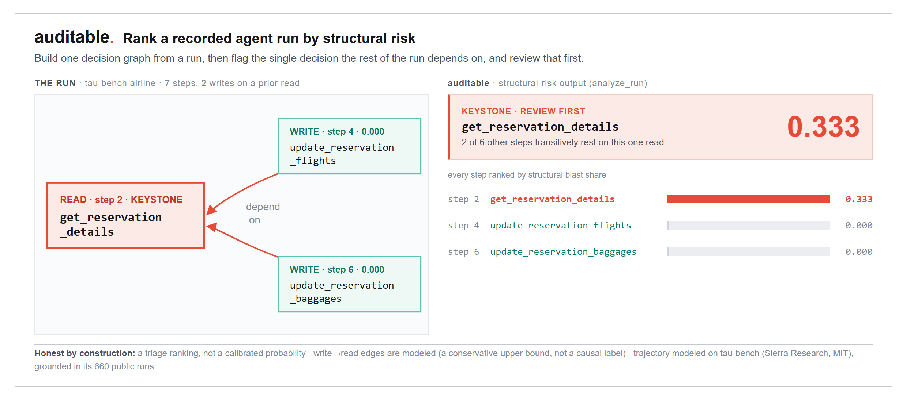
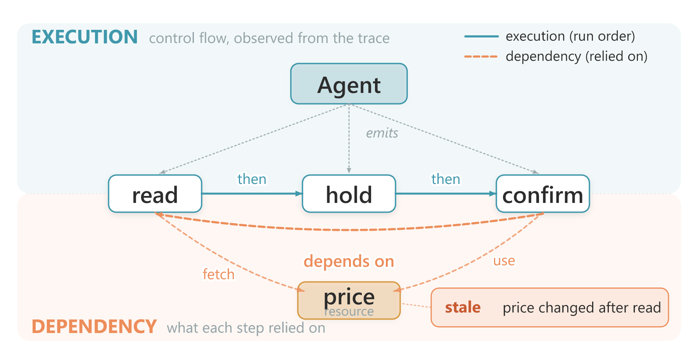

<div align="center">

# auditable

**Re-decide an agent's action against the state that is live now, and recover when it no longer holds.**

[](https://pypi.org/project/auditable/)
[](https://pypi.org/project/auditable/)
[](LICENSE)
[](https://github.com/yzhao062/auditable)

[Quickstart](#quickstart) · [How It Works](#how-it-works) · [The Full Chain](#the-full-chain) · [Roadmap](#roadmap)

</div>

`auditable` is an open-source SDK for auditing AI agent decisions. For every consequential decision it captures a signed record of what the agent read, the dependency state the decision relied on, which model decided, and the action taken. It **replays** that decision against the state that is live now, and when the action no longer holds it **executes** a fix through a rail: allow, block, hand to a human, or roll back.

## The Problem

Most agent tools log what happened. They do not record what the agent relied on when it decided, so when a payment, an approval, or a tool call later looks wrong, the budget, the policy, and the allow-list that were live at that moment are already gone. The action was reasoned; the dependency it trusted had drifted. Flagging that after the fact is observability. Re-deciding under the current state and reversing the action is recovery, and recovery is the gap `auditable` fills.

## Install

```bash
pip install auditable
```

Structural-risk analysis (`analyze_run` and the session graph) needs the optional graph extra:

```bash
pip install "auditable[graph]"
```

## Quickstart

```python
from auditable import Action, ActionGate, DependencySnapshot, ReferenceLedger, audit, replay

def policy(state, action):
    ok = action.cost <= state["budget"]
    return ok, "ok" if ok else "over budget"

ledger = ReferenceLedger(balance=10_000)
gate = ActionGate(ledger)
pay = Action("payment", {"to": "acme"}, cost=4_200)

# The agent pays $4,200 against a budget snapshot that said $10,000.
with audit("payment", snapshot=DependencySnapshot(state={"budget": 10_000})) as d:
    d.act(pay)
receipt = gate.commit(pay)                          # paid; balance now 5,800

# The live budget is now $3,000. Replay re-decides; the gate reverses the payment.
verdict = replay(d.record, live_state={"budget": 3_000}, policy=policy)
gate.enforce_post_commit(verdict, receipt=receipt)
print(verdict.action.value, "->", ledger.balance)  # rollback -> 10000
```

See [`examples/payment_audit.py`](examples/payment_audit.py) for the full demo that binds all three layers, and [`examples/standalone_report.py`](examples/standalone_report.py) for scoring a single layer on its own.

## Find the Keystone Decision

`analyze_run` reads a recorded agent run, builds one decision graph, and ranks every step by how much of the run transitively rests on it, so you can review the keystone first. On a tau-bench airline trajectory, the one reservation read that both later writes depend on is flagged as that keystone.



```python
from auditable import analyze_run
from auditable.graph.adapters import tau_bench_prior_db_reads_v1

report = analyze_run(run, adapter=tau_bench_prior_db_reads_v1)
k = report.keystone
print(k.idx, k.node_attrs["tool"])   # 2  get_reservation_details
```

The score is a triage ranking, not a calibrated probability, and the write-to-read edges are modeled (a conservative upper bound, not a causal label). The trajectory is modeled on [tau-bench](https://github.com/sierra-research/tau-bench) (Sierra Research, MIT) and grounded in a survey of its 660 public runs. See [`examples/analyze_run.py`](examples/analyze_run.py) (needs the `graph` extra).

## How It Works



*auditable links a run into one graph with two edge layers: execution (control flow, observed from the trace) over dependency (what each step relied on). When a step rested on a value that has since gone stale, like `price`, `replay` catches it. The record itself binds three spans per decision (data, model, harness), detailed below.*

One agent decision crosses three layers, and `auditable` binds all three in a single signed, hash-chained record:

| Layer | What the record binds | Signal in v0.1 |
|---|---|---|
| **Data** | What the agent read and the dependency snapshot it relied on | Snapshot freshness |
| **Model** | Which model produced the output, and its stated basis | Decision-basis trust flag |
| **Harness** | The action executed and its cost | A static rule, plus the replay verdict |

`replay()` re-derives whether the action still holds under the live dependency state versus the snapshot the agent used, and returns one of four verdicts: `ALLOW`, `ROLLBACK` (justified on the snapshot but not on live state, the stale-state case), `BLOCK` (justified on neither), or `HUMAN_REVIEW`. The `ActionGate` then executes that verdict through a rail, so a rollback reverses the action rather than printing a recommendation. Replay is pure: it never mutates the signed record.

## The Full Chain

The data, model, and harness signals live in one record, so a decision is judged as a unit rather than as three disconnected logs. Each layer's check is a standalone module (an `Auditor` that returns a signed `Report`), and the same modules compose into the decision record. Each layer deepens on its own cadence, and the method behind it carries its own benchmark before it is promoted.

| Layer | v0.1 (shipping) | Deepens to |
|---|---|---|
| **Harness (agent)** | signed record, replay, executed gate over a rail | dynamic rules layered on static rules |
| **Data** | snapshot freshness | anomaly detection on the data a decision relied on, [PyOD](https://github.com/yzhao062/pyod) lineage (v0.2) |
| **Model** | decision-basis trust flag | model as a first-class graph node attribute, with deterministic decision-basis grounding (v0.3) |

> [!IMPORTANT]
> **Scope, stated honestly.** The full chain, replay under live state, and executed recovery through a rail-neutral gate ship today, with thin but real data and model signals bound into the record and two sinks (in-memory and append-only JSONL). The v0.3 offline session-graph analyzer (`analyze_run`) ships too, as an uncalibrated structural ranking signal over a recorded run. The deep PyOD and TrustLLM methods, the calibrated cross-layer risk, live scoring, and the data and model control faces are on the [roadmap](#roadmap). The release does not yet claim a learned data-anomaly method or a model-trust score.

## Using a Single Layer

Each layer's check runs on its own, with no agent and no chain, and returns a signed report:

```python
import time
from auditable import DataAuditor, DependencySnapshot

snapshot = DependencySnapshot(state={"budget_remaining": 1000}, captured_at=time.time() - 7 * 86400)
report = DataAuditor(max_age_seconds=86400).assess(snapshot)
print(report.flag, report.score)   # stale 1.0
```

The composition (capture, replay, recovery) is the main line; the standalone modules are inputs to it.

## Roadmap

- [ ] **v0.2 Data** a fitted anomaly score on the dependency state ([PyOD](https://github.com/yzhao062/pyod) backend), with freshness as a fallback
- [x] **v0.3 Graph (offline)** the unified session decision graph plus structural risk (`analyze_run`), model a first-class node attribute with decision-basis grounding (homogeneous for now); ships as an uncalibrated ranking signal, with live incremental scoring and calibration still ahead
- [ ] **v0.4 Control** data refresh or quarantine, model fallback or sign-off
- [ ] **v1.0** pluggable sinks (OpenTelemetry, LangSmith), exportable evidence bundles, a stable public API
- [ ] Framework integrations (LangChain, LangGraph, CrewAI) and an MCP server

## Citation

If you use `auditable` in research, the decision-audit approach builds on the Auditable Agents framework:

```bibtex
@inproceedings{auditable-agents-2026,
  title  = {Auditable Agents},
  author = {Nian, Yi and Yuan, Aojie and Zhang, Haiyue and Li, Jiate and Zhao, Yue},
  year   = {2026},
  note   = {arXiv:2604.05485, ACL 2026 KnowFM Workshop}
}
```

## License

[Apache-2.0](LICENSE).
