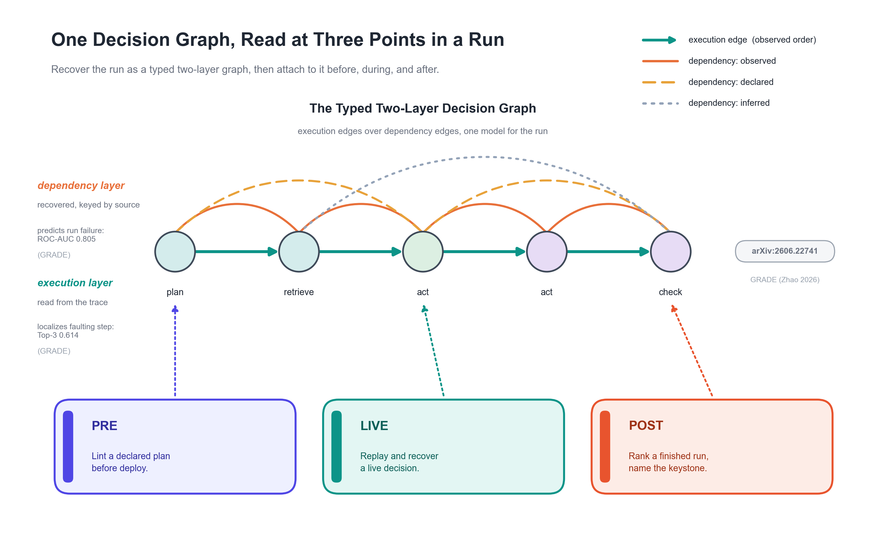

# auditable

Audit any agent decision across its past, present, and future, on one typed graph.

In plain terms: your AI agent makes a decision based on some state (a budget, a price, an allow-list), but that state can go stale by the time the agent acts. `auditable` records the decision, checks it again against the state that is live now, and undoes the action when the decision no longer holds. The same check also reviews a plan before you ship it and ranks a finished run so you know which step to look at first.

Here is the shortest taste. An agent pays a vendor against a budget that read $10,000. The budget later drops to $3,000, so the recorded decision no longer holds, and the payment is reversed:

```python
from auditable import Action, ActionGate, DependencySnapshot, ReferenceLedger, audit, replay

def policy(state, action):
    ok = action.cost <= state["budget"]
    return ok, "within budget" if ok else "over budget"

ledger = ReferenceLedger(balance=10_000)
gate = ActionGate(ledger)
payment = Action("payment", {"to": "acme"}, cost=4_200)

# The agent pays $4,200 against a budget snapshot that read $10,000.
with audit("payment", snapshot=DependencySnapshot(state={"budget": 10_000})) as decision:
    decision.act(payment)
receipt = gate.commit(payment)                       # paid; balance is now 5,800

# The live budget is now $3,000. Replay re-decides; the gate reverses the payment.
verdict = replay(decision.record, live_state={"budget": 3_000}, policy=policy)
gate.enforce_post_commit(verdict, receipt=receipt)
print(verdict.action.value, "->", ledger.balance)   # rollback -> 10000
```

That is the LIVE pillar, the sharpest of three. The same library also lints a plan before deploy (PRE) and ranks a finished run (POST). The [Quickstart](quickstart.md) has the smallest snippet for each, and [Lifecycle](lifecycle.md) is the map across all three.

## How It Works: One Graph Across the Lifecycle

The rest of this page is the conceptual model behind the snippet. Skip to the [Quickstart](quickstart.md) if you just want to run code.

`auditable` audits AI agent decisions at three points in an agent's life. The same typed two-layer decision graph is scored and reported before deploy, while the agent runs, and after a run finishes. Detection and report generation run on one graph kernel, so the same construction serves every pillar.

## One Graph Consolidates Everything

The differentiator is a single typed decision graph that three orthogonal views project onto. You do not assemble three disconnected tools; one structure carries the analysis.

- **Lifecycle (when a check fires):** PRE before deploy, LIVE while running, POST after a run. One graph, three attach points.
- **Signal (what each decision binds):** data, model, and harness, the three orthogonal spans bound per decision.
- **Coverage (which standard a finding maps to):** OWASP and CWE threats expressed as graph-structural predicates rather than a flat checklist. See [PRE Coverage](pre-coverage.md).



Because every view lands on one graph, detection and report run on one structure instead of three. That is the honest answer to "is this enough": not more rules, one consolidated substrate. Threats with no structural signature, such as prompt injection or content poisoning, route to LIVE or stay out of scope; the [Coverage](pre-coverage.md) page states that boundary.

## The Lifecycle

| Pillar | When it fires | Focus | Public entry |
|---|---|---|---|
| PRE | Design time, before any step runs | Lint a declared plan, name the control-flow chokepoint, withhold dependency-state risk | `analyze_plan` (from `auditable.graph.pre`) |
| LIVE | While the agent runs | Capture a decision, re-decide under live state, route a fix through a rail | `replay` plus `ActionGate` |
| POST | After a run completes | Rank a finished run by structural blast share, name the keystone | `analyze_run` |

See [Lifecycle](lifecycle.md) for each pillar in detail, and [`examples/example_end_to_end.py`](https://github.com/yzhao062/auditable/blob/main/examples/example_end_to_end.py) for one payment carried through all three.

## What Makes It New

- **A unified graph representation for agentic AI.** Every agent run becomes one typed graph that PRE, LIVE, and POST all read, one representation from plan to live operation to review. The two-layer model is introduced in GRADE ([arXiv:2606.22741](https://arxiv.org/abs/2606.22741)).
- **Recover, do not just observe.** `auditable` captures the dependency state a decision relied on, replays it under the state that is live now, and reverses the committed action through a compensating rail when it no longer holds. Logging tells you what broke; `auditable` undoes it.
- **One decision, three spans, judged together.** Data, model, and harness are bound in a single signed, hash-chained record, so a decision is audited as one unit, not three disconnected logs.
- **Plug in the agent you already run.** Wrap a real LangGraph `StateGraph` (TypedDict state, plain sync or async function nodes) with `instrument(...)` and every node's reads and writes over the state channels become observed dependency edges; the framework-agnostic `TouchRecorder` does the same for any loop. See [Capturing a Real Run](architecture.md#capturing-a-real-run).

| Span | What the record binds | Signal in v0.1 |
|---|---|---|
| **Data** | What the agent read and the dependency snapshot it relied on | Snapshot freshness |
| **Model** | Which model produced the output, and its stated basis | Decision-basis trust flag |
| **Harness** | The action executed and its cost | A static cost-cap rule, plus the replay verdict |

## Install

```bash
pip install auditable            # core: capture, replay, recovery
pip install "auditable[graph]"   # adds the graph analyses (PRE lints, POST analyze_run)
pip install "auditable[langgraph]"   # capture a real LangGraph run
```

The graph extra pulls in NetworkX, which the PRE and POST graph entries need.

## Where to Start

- [Quickstart](quickstart.md): the smallest runnable snippet for each pillar, plus the Markdown report renderer.
- [Lifecycle](lifecycle.md): the map across PRE, LIVE, and POST.
- [PRE Coverage](pre-coverage.md): how the lints map to OWASP and CWE.
- [Audit Report](audit-report.md): the Markdown and PDF report a run produces.
- [API Reference](api.md): the full public surface.

The fastest way to see the whole lifecycle on one dataset is [`examples/example_end_to_end.py`](https://github.com/yzhao062/auditable/blob/main/examples/example_end_to_end.py): one vendor payment walked through PRE, LIVE, and POST with a single `python examples/example_end_to_end.py`. To capture your own agent, [`examples/example_langgraph_capture.py`](https://github.com/yzhao062/auditable/blob/main/examples/example_langgraph_capture.py) lowers a real LangGraph run into the observed dependency graph, and [`examples/example_touch_capture.py`](https://github.com/yzhao062/auditable/blob/main/examples/example_touch_capture.py) does the same for any loop.
